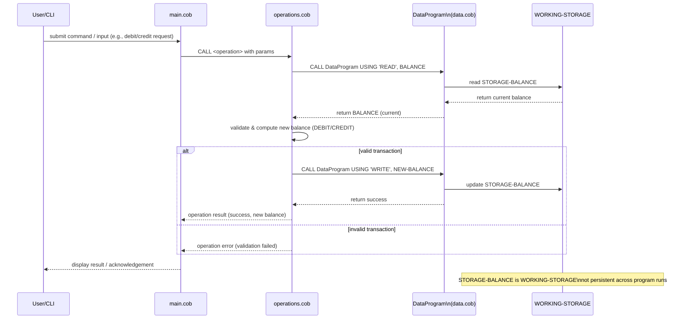
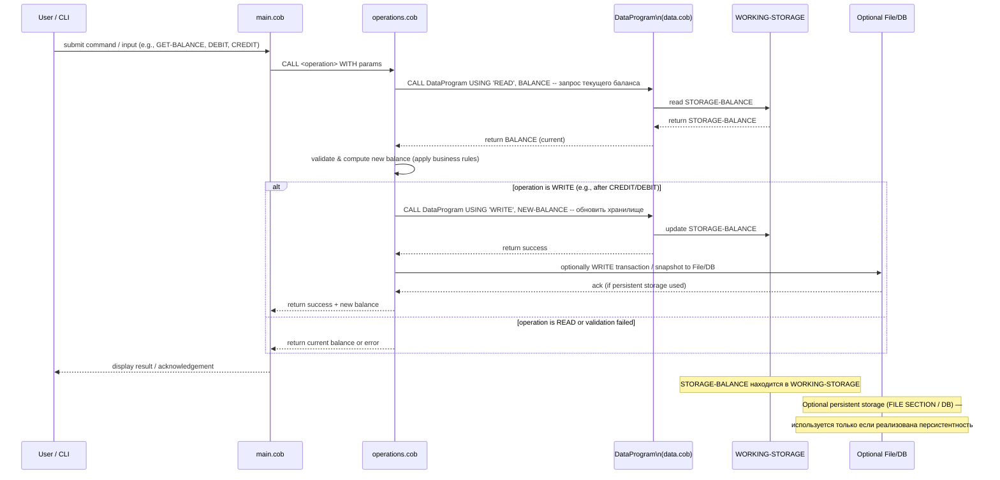

# Документация по COBOL-части проекта

Дата: 11 ноября 2025

## Краткое описание
В этом каталоге описаны предназначение COBOL-файлов, ключевые процедуры и бизнес-правила, связанные со счетами студентов. Исходный код находится в `src/cobol/`.

## Файлы и их назначение
- `src/cobol/data.cob` — модуль работы с данными (подпрограмма `DataProgram`).
  - Хранит поле `STORAGE-BALANCE` (PIC 9(6)V99) с исходным значением 1000.00.
  - Объявляет `LINKAGE SECTION` с параметрами `PASSED-OPERATION` (PIC X(6)) и `BALANCE` (PIC 9(6)V99).
  - В `PROCEDURE DIVISION USING PASSED-OPERATION BALANCE` реализована простая операция чтения/записи баланса:
    - Если `PASSED-OPERATION` = 'READ' — копирует `STORAGE-BALANCE` в переданный `BALANCE`.
    - Если `PASSED-OPERATION` = 'WRITE' — копирует входной `BALANCE` в `STORAGE-BALANCE`.
  - В конце подпрограммы — `GOBACK`.

- `src/cobol/operations.cob` — (описание на основании соглашения о наименовании; файл присутствует в репозитории)
  - Ожидаемая роль: содержит бизнес-операции над аккаунтом студента (например, начисление/списание, перевод, валидация сумм).
  - Должен вызывать `DataProgram` (подпрограмму из `data.cob`) для получения или обновления баланса.
  - Ключевые процедуры (предполагаемые): `CREDIT-ACCOUNT`, `DEBIT-ACCOUNT`, `GET-BALANCE`, `SET-BALANCE`, `VALIDATE-TRANSACTION`.

- `src/cobol/main.cob` — (описание на основании соглашения о наименовании; файл присутствует в репозитории)
  - Ожидаемая роль: главный модуль/точка входа приложения.
  - Управляет потоком выполнения: парсит входные параметры (или пользовательский ввод), вызывает процедуры из `operations.cob`, взаимодействует с `data.cob` для чтения/записи баланса, завершает работу.

> Примечание: содержимое `operations.cob` и `main.cob` не было включено в задание; описания выше — разумные предположения на основе структуры и стандартных практик. См. раздел "Допущения".

## Ключевые функции и контракты (контракт модуля `DataProgram`)
- Вход: `PASSED-OPERATION` (строковый код операции, например 'READ' или 'WRITE'), `BALANCE` (числовой параметр для передачи/приёма значения баланса).
- Выход: при 'READ' — `BALANCE` заполняется значением из `STORAGE-BALANCE`; при 'WRITE' — `STORAGE-BALANCE` обновляется значением `BALANCE`.
- Формат числа: PIC 9(6)V99 — целая часть до 6 цифр, 2 знака после запятой; диапазон значений: от 0.00 до 999999.99 (по представленному описанию формата).
- Поведение при ошибке: в текущей реализации явной обработки ошибок нет (нет проверки переполнения, отрицательных значений, форматной валидации). Подпрограмма просто копирует данные.

## Бизнес-правила, связанные со счётом студента
1. Начальный баланс по умолчанию: 1000.00 (значение `STORAGE-BALANCE` в `data.cob`).
2. Два базовых типа операций для взаимодействия с балансом через `DataProgram`:
   - `READ` — вернуть текущий баланс вызывающему модулю.
   - `WRITE` — записать новый баланс в хранилище `STORAGE-BALANCE`.
3. Формат хранения и передачи суммы: фиксированный формат PIC 9(6)V99. Любые входные/выходные суммы должны соответствовать этому формату.
4. Отсутствие долговременного хранения: текущее `STORAGE-BALANCE` определено в секции WORKING-STORAGE подпрограммы. Это означает, что значение хранится в оперативной памяти процесса/подпрограммы и:
   - Имеет начальное значение 1000.00 при загрузке программы.
   - Не устойчиво между запусками программы; для персистентного хранения требуется внешний файл/БД или системный файл круга (например, VSAM, обычный файл или СУБД).
5. Валидация транзакций отсутствует в `data.cob` и должна выполняться в `operations.cob` или `main.cob`:
   - Проверять, что при списании баланс не уходит в отрицательное значение (если бизнес-требование — запрет овердрафта).
   - Проверять диапазон (не превышает 999999.99).
   - Обрабатывать некорректные коды операций (любой код, отличный от 'READ'/'WRITE', должен приводить к контролируемой ошибке/логированию).
6. Параллелизм/согласованность: если несколько потоков/процессов будут работать с одной и той же логикой, требуется механизм блокировок или централизованное хранилище, т.к. WORKING-STORAGE не обеспечивает совместного доступа.

## Рекомендации по улучшению (малый и безопасный набор шагов)
- Добавить в `DataProgram` базовую валидацию входных данных (проверка на корректный формат и границы) и код возврата (return code) при некорректных условиях.
- Для долговременного хранения баланса: переместить `STORAGE-BALANCE` в файл доступа (FILE SECTION) или использовать внешнюю СУБД; тогда `DataProgram` должен уметь открывать/закрывать и синхронизировать данные.
- Добавить логирование изменений баланса (журнал транзакций) для аудита и отката при ошибках.
- В `operations.cob` реализовать атомарные операции: `DEBIT` и `CREDIT` с проверкой правил (например, запрет на отрицательное значение, лимиты транзакций).

## Контракты для тестирования и проверки
- Тест 1 (чтение): вызвать `DataProgram` с `PASSED-OPERATION='READ'` и убедиться, что возвращаемый `BALANCE` = 1000.00 (при отсутствии предварительных записей).
- Тест 2 (запись): вызвать с `PASSED-OPERATION='WRITE'` и `BALANCE=1500.50`, затем `READ` — ожидать 1500.50 (в рамках одного запуска/процесса).
- Тест 3 (валидация): попытки записать значения > 999999.99 или отрицательные должны приводить к ошибке/отказу после внедрения валидации.

## Допущения
- Содержимое `data.cob` использовано из приложенного файла. Файлы `main.cob` и `operations.cob` присутствуют в репозитории, но их точное содержимое не было предоставлено; описания для них составлены как разумные предположения по их именам и общему назначению.
- Предполагается, что `DataProgram` используется как подпрограмма (вызов через `CALL`/`CALL 'DataProgram'`) из `main.cob` или `operations.cob`.

## Следующие шаги (предлагаемые)

## Диаграмма последовательности (data flow) — Mermaid

Ниже — последовательная диаграмма в формате Mermaid, показывающая типичный поток данных между входом, `main.cob`, `operations.cob` и `data.cob` (подпрограммой `DataProgram`). Диаграмму можно визуализировать в любом Markdown-рендерере, поддерживающем Mermaid.

Файл создан автоматически на основе предоставленного `data.cob` и разумных допущений о структуре проекта. Ниже — последовательная диаграмма в формате Mermaid, специально помещённая в конец файла для удобного рендеринга.

## Sequence diagram (Mermaid) — Data flow of the app

Если хотите, я могу:
